# Duocards - Flashcard App for Language Learning

A mobile-first flashcard application designed to help users learn vocabulary efficiently using a simplified spaced repetition algorithm. Built with React, TypeScript, and Tailwind CSS.

## Features

### 🧠 Simplified Spaced Repetition Algorithm

- **Simple 2-Button System**: Just mark cards as correct or incorrect
- **Intuitive Gestures**:
  - **Swipe Left / ←** - Mark as incorrect
  - **Swipe Right / →** - Mark as correct
- **3 Simple Statuses**:
  - **New**: Cards you haven't started learning yet
  - **Learning**: Cards you're actively memorizing (1 min → 10 min steps)
  - **Learned**: Cards you've successfully learned with increasing intervals
- **Smart Intervals**:
  - Correct answers multiply interval by 2.5x
  - Incorrect answers reduce interval by 75%
  - Cards that fail go back to learning phase
- **No Duplicates**: Cards won't repeat in the same session

### 📚 Core Features

- **Add Cards**: Create flashcards with English, Vietnamese, examples, and phonetics
- **Cambridge Dictionary Integration**: Auto-fetch word definitions and examples
- **Text-to-Speech**: Pronunciation support for words and example sentences
- **Mobile-First Design**: Optimized for smartphones with swipe gestures
- **Real-time Statistics**: Track your learning progress
- **Cloud Sync**: Optional authentication (Google & Facebook) with Supabase backend
- **Local-First**: Works offline, syncs when online
- **Cross-Device**: Access your cards from any device after signing in

### ⌨️ Controls

During review:

- **Any key**: Flip card (when showing front)
- **Arrow Left (←)**: Mark as incorrect
- **Arrow Right (→)**: Mark as correct
- **Swipe Left**: Mark as incorrect
- **Swipe Right**: Mark as correct

## Algorithm Diagrams

### 1. Simplified Learning Flow

This diagram shows the streamlined learning process with just two possible actions at each step:


### 2. Simplified Algorithm Components

This diagram shows the core components of the simplified algorithm:

```mermaid
graph LR
    subgraph "Card Properties"
        Status["Status<br/>(3 states)"]
        Interval["Interval<br/>(days)"]
        StepIndex["Learning Step<br/>(0-1)"]
    end

    subgraph "User Actions"
        Incorrect["❌ Incorrect<br/>(Swipe Left / ←)"]
        Correct["✅ Correct<br/>(Swipe Right / →)"]
    end

    subgraph "Algorithm Rules"
        Multiplier["Fixed Multipliers<br/>(2.5x / 0.25x)"]
        LearningSteps["Learning Steps<br/>(1min → 10min)"]
        SessionQueue["Session Queue<br/>(No repeats)"]
    end

    Status --> Algorithm["Simple<br/>Scheduler"]
    Interval --> Algorithm
    StepIndex --> Algorithm

    Incorrect --> Algorithm
    Correct --> Algorithm

    Algorithm --> NextReview["Next Review<br/>Scheduled"]
    Algorithm --> UpdatedStatus["Updated<br/>Status"]

    Multiplier --> Algorithm
    LearningSteps --> Algorithm
    SessionQueue --> Algorithm

    classDef input fill:#94a3b8,stroke:#64748b,color:#000
    classDef action fill:#fbbf24,stroke:#f59e0b,color:#000
    classDef rule fill:#60a5fa,stroke:#3b82f6,color:#000
    classDef output fill:#86efac,stroke:#22c55e,color:#000

    class Status,Interval,StepIndex input
    class Incorrect,Correct action
    class Multiplier,LearningSteps,SessionQueue rule
    class NextReview,UpdatedStatus output
```



---

## Getting Started

### Prerequisites

- Node.js 16+
- pnpm (recommended) or npm

### Installation

```bash
# Clone the repository
git clone https://github.com/yourusername/duocards.git
cd duocards

# Install dependencies
pnpm install

# Start development server
pnpm dev

# For Cambridge dictionary integration, also run:
node cambridge-proxy.js
```

### Build for Production

```bash
pnpm build
pnpm preview
```

## How the Algorithm Works

### Simple Progression

The algorithm uses fixed multipliers for predictable behavior:

1. **Correct answer**: Interval × 2.5
2. **Incorrect answer**: Interval × 0.25

### Learning Phase

- **Step 1**: Review after 1 minute
- **Step 2**: Review after 10 minutes
- **Graduation**: Review after 1 day

### Example Progression

```
New → Correct (1 min) → Correct (10 min) → Correct (1 day) → Correct (2.5 days) → Correct (6.25 days) → ...
     ↓ Incorrect                            ↓ Incorrect (if < 1 day)
     Back to 1 min                          Back to Learning
```

## Technology Stack

- **Frontend**: React 18, TypeScript
- **Styling**: Tailwind CSS, shadcn/ui
- **Routing**: React Router
- **State Management**: Zustand with persist middleware
- **Authentication**: Supabase Auth (Google & Facebook OAuth)
- **Database**: Supabase (PostgreSQL)
- **Storage**: localStorage (local-first) + Supabase (cloud sync)
- **Build**: Vite
- **Package Manager**: pnpm

## Data Storage & Synchronization

### Local-First Architecture

The app uses a **local-first** approach where:

- All data is stored locally in the browser's localStorage
- Every interaction feels instant (no network delays)
- Works completely offline
- Cards are automatically migrated from older formats

### Cloud Sync (Optional)

When you sign in (Google or Facebook):

- Your local cards are automatically synced to Supabase
- Cards are backed up securely in the cloud
- Access your cards from any device
- Automatic conflict resolution between devices
- Periodic background sync every 5 minutes

### How Sync Works

1. **First Sign-In**: Local cards are uploaded to the cloud
2. **Subsequent Sign-Ins**: Cards are merged intelligently
3. **Conflict Resolution**: Newer cards take precedence
4. **Optimistic Updates**: All changes are instant locally, then synced
5. **Sign-Out**: Local data remains, cloud sync stops

### Supabase Setup

To enable cloud sync:

1. Create a new Supabase project at [supabase.com](https://supabase.com)
2. Copy `.env.example` to `.env.local` and fill in your credentials:
   ```env
   VITE_SUPABASE_URL=your_supabase_project_url
   VITE_SUPABASE_ANON_KEY=your_supabase_anon_key
   ```
3. Configure OAuth providers in your Supabase dashboard:
   - Go to Authentication > Settings
   - Enable Google provider and/or Facebook provider
   - Add your site URL to allowed redirect URLs
   - For Facebook: See [FACEBOOK_SETUP.md](./FACEBOOK_SETUP.md) for detailed instructions
4. Run the database migration:
   ```sql
   -- Copy and run the contents of supabase_migration.sql in your SQL editor
   ```

### Database Schema

The Supabase database uses:

- **Row Level Security (RLS)** for user isolation
- **Automatic timestamping** for created_at/updated_at
- **Optimized indexes** for performance
- **User-scoped policies** for data security

## Contributing

Contributions are welcome! Please feel free to submit a Pull Request.

## License

MIT

## Acknowledgments

- Inspired by Anki and SuperMemo algorithms
- Cambridge Dictionary for word definitions
- The spaced repetition research community

---

## Troubleshooting

- **Port already in use?**
  - If you see a message like `Port 5173 is in use, trying another one...`, Vite will automatically try the next available port (e.g., 5174).
  - To specify a port manually, run: `pnpm dev -- --port=5180`

## Features

## Pre-commit Formatting

This project uses [Prettier](https://prettier.io/), [lint-staged](https://github.com/okonet/lint-staged), and [Husky](https://typicode.github.io/husky) to automatically format staged files before each commit.

- To manually format all files, run:
  ```sh
  pnpm format
  ```
- On each commit, only staged files will be formatted automatically.
- If you install dependencies, Husky will be set up automatically via the `prepare` script.
- You can **edit** any flashcard by clicking the pencil icon on the Home screen. This opens the edit form, pre-filled with the card's data.
- You can **delete** any flashcard by clicking the trash icon on the Home screen. You will be asked to confirm before deletion.
- The add card form is also used for editing cards. The edit route is `/edit/:id`.

## Notification System

A global notification (toast) system is implemented using Zustand and a Notification component. To show a notification, use the `showNotification` action from the UI store:

```ts
const { showNotification } = useUIActions();
showNotification('success', 'Card added successfully!');
```

Notifications will appear at the top of the screen and auto-hide after a few seconds. You can also manually dismiss them.
