# Duocards - Flashcard App for Language Learning

A mobile-first flashcard application designed to help users learn vocabulary efficiently using a simplified spaced repetition algorithm. Built with React, TypeScript, and Tailwind CSS.

## Features

### 🧠 Simplified Spaced Repetition Algorithm

- **Simple 2-Button System**: Just mark cards as correct or incorrect
- **Intuitive Gestures**:
  - **Swipe Left / ←** - Mark as incorrect
  - **Swipe Right / →** - Mark as correct
- **3 Simple Statuses**:
  - **New**: Cards you haven't started learning yet
  - **Learning**: Cards you're actively memorizing (1 min → 10 min steps)
  - **Learned**: Cards you've successfully learned with increasing intervals
- **Smart Intervals**:
  - Correct answers multiply interval by 2.5x
  - Incorrect answers reduce interval by 75%
  - Cards that fail go back to learning phase
- **No Duplicates**: Cards won't repeat in the same session

### 📚 Core Features

- **Add Cards**: Create flashcards with English, Vietnamese, examples, and phonetics
- **Cambridge Dictionary Integration**: Auto-fetch word definitions and examples
- **Text-to-Speech**: Pronunciation support for words and example sentences
- **Mobile-First Design**: Optimized for smartphones with swipe gestures
- **Real-time Statistics**: Track your learning progress

### ⌨️ Controls

During review:

- **Any key**: Flip card (when showing front)
- **Arrow Left (←)**: Mark as incorrect
- **Arrow Right (→)**: Mark as correct
- **Swipe Left**: Mark as incorrect
- **Swipe Right**: Mark as correct

## Algorithm Diagrams

### 1. Simplified Learning Flow

This diagram shows the streamlined learning process with just two possible actions at each step:

```mermaid
graph TB
    Start["🆕 New Card"] --> Learning1["📚 Learning<br/>(1 minute)"]

    Learning1 -->|"❌ Incorrect"| Learning1
    Learning1 -->|"✅ Correct"| Learning2["📚 Learning<br/>(10 minutes)"]

    Learning2 -->|"❌ Incorrect"| Learning1
    Learning2 -->|"✅ Correct"| Learned["✅ Learned<br/>(1 day)"]

    Learned -->|"❌ Incorrect<br/>(interval × 0.25)"| CheckInterval{"Interval < 1 day?"}
    Learned -->|"✅ Correct<br/>(interval × 2.5)"| NextReview["✅ Learned<br/>(2.5 days → 6.25 days → ...)"]

    CheckInterval -->|"Yes"| BackToLearning["📚 Back to Learning<br/>(1 minute)"]
    CheckInterval -->|"No"| ReducedInterval["✅ Learned<br/>(Reduced interval)"]

    BackToLearning --> Learning1
    NextReview -->|"✅ Correct"| LongerIntervals["✅ Learned<br/>(15.6 days → 39 days → ...)"]

    classDef newCard fill:#3b82f6,stroke:#2563eb,color:#fff
    classDef learning fill:#eab308,stroke:#ca8a04,color:#000
    classDef learned fill:#22c55e,stroke:#16a34a,color:#fff

    class Start newCard
    class Learning1,Learning2,BackToLearning learning
    class Learned,NextReview,LongerIntervals,ReducedInterval learned
```



### 2. Simplified Algorithm Components

This diagram shows the core components of the simplified algorithm:


---

## Getting Started

### Prerequisites

- Node.js 16+
- pnpm (recommended) or npm

### Installation

```bash
# Clone the repository
git clone https://github.com/yourusername/duocards.git
cd duocards

# Install dependencies
pnpm install

# Start development server
pnpm dev

# For Cambridge dictionary integration, also run:
node cambridge-proxy.js
```

### Build for Production

```bash
pnpm build
pnpm preview
```

## How the Algorithm Works

### Simple Progression

The algorithm uses fixed multipliers for predictable behavior:

1. **Correct answer**: Interval × 2.5
2. **Incorrect answer**: Interval × 0.25

### Learning Phase

- **Step 1**: Review after 1 minute
- **Step 2**: Review after 10 minutes
- **Graduation**: Review after 1 day

### Example Progression

```
New → Correct (1 min) → Correct (10 min) → Correct (1 day) → Correct (2.5 days) → Correct (6.25 days) → ...
     ↓ Incorrect                            ↓ Incorrect (if < 1 day)
     Back to 1 min                          Back to Learning
```

## Technology Stack

- **Frontend**: React 18, TypeScript
- **Styling**: Tailwind CSS, shadcn/ui
- **Routing**: React Router
- **State**: React hooks, localStorage
- **Build**: Vite
- **Package Manager**: pnpm

## Data Storage

All data is stored locally in the browser's localStorage. Cards are automatically migrated from older formats to the new simplified algorithm structure.

## Contributing

Contributions are welcome! Please feel free to submit a Pull Request.

## License

MIT

## Acknowledgments

- Inspired by Anki and SuperMemo algorithms
- Cambridge Dictionary for word definitions
- The spaced repetition research community

---

## Troubleshooting

- **Port already in use?**
  - If you see a message like `Port 5173 is in use, trying another one...`, Vite will automatically try the next available port (e.g., 5174).
  - To specify a port manually, run: `pnpm dev -- --port=5180`

## Features

- You can **edit** any flashcard by clicking the pencil icon on the Home screen. This opens the edit form, pre-filled with the card's data.
- You can **delete** any flashcard by clicking the trash icon on the Home screen. You will be asked to confirm before deletion.
- The add card form is also used for editing cards. The edit route is `/edit/:id`.
