# Duocards - Flashcard App for Language Learning

A mobile-first flashcard application designed to help users learn vocabulary efficiently using an advanced spaced repetition algorithm. Built with React, TypeScript, and Tailwind CSS.

## Features

### 🧠 Advanced Spaced Repetition Algorithm

- **SM-2 Inspired Algorithm**: Implements a sophisticated spaced repetition system based on proven memory research
- **4-Button Review System**:
  - 😕 **Again** - Forgot the card (resets progress)
  - 😐 **Hard** - Difficult but remembered (smaller interval increase)
  - 🙂 **Good** - Normal difficulty (standard interval increase)
  - 😊 **Easy** - Very easy (larger interval increase)
- **Learning Phases**:
  - **New Cards**: Start with short intervals (1 min → 10 min → 1 day)
  - **Learning**: Cards in the process of initial memorization
  - **Review**: Graduated cards with increasing intervals
  - **Relearning**: Forgotten cards get a second chance with shorter steps
- **Ease Factor**: Tracks individual card difficulty (130% to 250%)
- **Smart Scheduling**: Prevents the same card from appearing multiple times in one session

### 📚 Core Features

- **Add Cards**: Create flashcards with English, Vietnamese, examples, and phonetics
- **Cambridge Dictionary Integration**: Auto-fetch word definitions and examples
- **Text-to-Speech**: Pronunciation support for words and example sentences
- **Mobile-First Design**: Optimized for smartphones with responsive layout
- **Real-time Statistics**: Track your learning progress

### ⌨️ Keyboard Shortcuts

During review:

- **Any key**: Flip card (when showing front)
- **1**: Again
- **2**: Hard
- **3**: Good
- **Space/Enter**: Good (default)
- **4**: Easy
- **↑/↓**: Flip back to front

## Algorithm Diagrams

### 1. Spaced Repetition Flow

This diagram shows the learning and review flow for a single card, including learning, review, and relearning steps:

```mermaid
graph TB
    Start["🆕 New Card"] --> Learning1["📚 Learning<br/>(1 minute)"]

    Learning1 -->|"😕 Again"| Learning1
    Learning1 -->|"😐 Hard"| Learning1
    Learning1 -->|"🙂 Good"| Learning2["📚 Learning<br/>(10 minutes)"]
    Learning1 -->|"😊 Easy"| Graduated["✅ Review<br/>(4 days)"]

    Learning2 -->|"😕 Again"| Learning1
    Learning2 -->|"😐 Hard"| Learning2
    Learning2 -->|"🙂 Good"| GraduatedNormal["✅ Review<br/>(1 day)"]
    Learning2 -->|"😊 Easy"| Graduated

    GraduatedNormal -->|"😕 Again"| Relearning["🔄 Relearning<br/>(10 minutes)"]
    GraduatedNormal -->|"😐 Hard"| Review1["✅ Review<br/>(1.2 days)"]
    GraduatedNormal -->|"🙂 Good"| Review2["✅ Review<br/>(2.5 days)"]
    GraduatedNormal -->|"😊 Easy"| Review3["✅ Review<br/>(3.25 days)"]

    Graduated -->|"😕 Again"| Relearning
    Review1 -->|"😕 Again"| Relearning
    Review2 -->|"😕 Again"| Relearning
    Review3 -->|"😕 Again"| Relearning

    Relearning -->|"😕 Again"| Relearning
    Relearning -->|"😐/🙂/😊"| BackToReview["✅ Back to Review<br/>(Previous interval)"]

    Review2 -->|"🙂 Good"| LongerIntervals["✅ Review<br/>(6.25 days → 15.6 days → ...)"]

    classDef newCard fill:#3b82f6,stroke:#2563eb,color:#fff
    classDef learning fill:#eab308,stroke:#ca8a04,color:#000
    classDef review fill:#22c55e,stroke:#16a34a,color:#fff
    classDef relearning fill:#ef4444,stroke:#dc2626,color:#fff

    class Start newCard
    class Learning1,Learning2 learning
    class Graduated,GraduatedNormal,Review1,Review2,Review3,LongerIntervals,BackToReview review
    class Relearning relearning
```



### 2. Key Components of the Algorithm

This diagram shows the main properties, user actions, and features that drive the scheduling algorithm:


---

## Getting Started

### Prerequisites

- Node.js 16+
- pnpm (recommended) or npm

### Installation

```bash
# Clone the repository
git clone https://github.com/yourusername/duocards.git
cd duocards

# Install dependencies
pnpm install

# Start development server
pnpm dev

# For Cambridge dictionary integration, also run:
node cambridge-proxy.js
```

### Build for Production

```bash
pnpm build
pnpm preview
```

## How the Algorithm Works

### Interval Calculation

The algorithm calculates the next review interval based on:

1. **Current interval**: How long since the last review
2. **Ease factor**: Card-specific difficulty modifier (1.3 to 2.5)
3. **Your response**: Again/Hard/Good/Easy

### Learning Steps

- **New cards**: 1 minute → 10 minutes → 1 day (graduated)
- **Failed cards**: 10 minutes → back to review
- **Easy button**: Skips learning steps, sets 4-day initial interval

### Example Progression

```
New Card → Good (1 min) → Good (10 min) → Good (1 day) → Good (2.5 days) → Good (6 days) → ...
         ↓ Again                          ↓ Again
    Back to 1 min                   Relearning (10 min)
```

## Technology Stack

- **Frontend**: React 18, TypeScript
- **Styling**: Tailwind CSS, shadcn/ui
- **Routing**: React Router
- **State**: React hooks, localStorage
- **Build**: Vite
- **Package Manager**: pnpm

## Data Storage

All data is stored locally in the browser's localStorage. Cards are automatically migrated from older formats to the new algorithm structure.

## Contributing

Contributions are welcome! Please feel free to submit a Pull Request.

## License

MIT

## Acknowledgments

- Inspired by Anki and SuperMemo algorithms
- Cambridge Dictionary for word definitions
- The spaced repetition research community

---

## Troubleshooting

- **Port already in use?**
  - If you see a message like `Port 5173 is in use, trying another one...`, Vite will automatically try the next available port (e.g., 5174).
  - To specify a port manually, run: `pnpm dev -- --port=5180`
